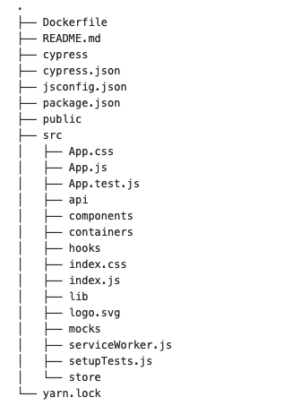

## Deployed application url

https://transcripts-processing.vercel.app/

## Required dependencies

`nodejs`, `yarn` or `npm`

## Running the application

1. Run `yarn install` or `npm install`
2. Run `yarn run start` or `npm run start`
3. Open `localhost:3000`

## Running tests

Assuming you have completed above steps.

### Unit tests

`yarn run test` or `npm run test`

### Integration tests (uses Cypress)

Please note that cypress installation can take sometime. Also the e2e have not been CI ready at the moment so running them is a manual process for now.

1. `yarn run e2e` or `npm run e2e`
2. Select `app.test.js` from cypress app

## Building the application for production

`yarn run build` or `npm run build`

This would produce a `build` folder containing all the static files which can be deployed using any statis server(such as `serve`) to run the application.

## Building and running the application using Docker

Project can be build and run via docker (for details see `Dockerfile` in project root).
It utilises multistep docker build so that image size small and optimized.

From the root folder run:

```
docker build -t i2x .
docker run --rm -it  -p 3000:3000/tcp i2x:latest
```

## Application architecture

- App uses react `hooks` which enables us to use functional components. Because of the usage of functional components I have tried to use `React.memo` HOC for implicit shallow comparison/memoization.
- App uses dependency injection for `store` and `ASRClient` using `context` api of `react`. This makes unit testing easy with mocked data.

The basic structure of the app is given below:



Most important directories inside `src` alongwith their definitions are:

- `api` - contains `ASRClient`
- `components` - contains pure UI reusable components
- `containers` - components which uses `components` and contains store/api integration
- `lib`- contains helper functions for various operations
- `hooks` - contains any custom re-usable react hooks
- `mocks` - mock that can be used for testing
- `store` - contains `redux` related functions(`actions`, `reducers`)

- `App.js` - main file which combined `container` components to form the application
- `index.js` - Initializes dependencies such as `store` and `ASRClient` - Renders `<App/>` using `ReactDom` and inject above dependencies which can accessed by any `container` components

Other directories/files

- `cypress` - contains integration tests using `cypress`
- `Dockerfile` - docker `build` for the project
- `public` - contains static assets and html file

## Libraries used

App uses `create-react-app` and adds few more additional libs on top of it.

- `@reduxjs/toolkit` - for redux related functionalities such as `actions`, `reducer`, `store`
- `react-redux` - for hooks based integration of redux such as `useSelector`, `useDispatch`
- `@reach/router` - for routing
- `jest` - for running unit tests
- `@testing-library/react` - for unit testing components
- `cypress` - for integration/e2e testing

## Testing approach

### Unit testing

Unit testing has been done keeping in mind what is input to any component and what is output rather than trying to test implementations details.
Components are fully mounted in all the tests and then the test resembles how the user would use them when they are shown as part of UI.

`@testing-library/react` helps in acheiving that as it enforces all these best practices.

It also uses mock for `ASRClient` in unit tests.

All the unit tests are stored along with components i.e `component.test.js`

### Integration/e2e testing

App uses `cypress` to implement integration testing.
Scenarios such as Start session, Stop session are tested but due an issue with browsers not able to simulate `getUserMedia` for audio streams, it was not possible to pass an audio stream to test audio rendering part.

All the integration tests are stored in `cypress` folder at the root of application.

## CSS

App uses `css modules` for CSS and also utilizes CSS variables for theming(color).

## CI

Project uses github actions for running tests in CI - https://github.com/swapnilfrontend/speech-to-text/actions?query=workflow%3ATest
